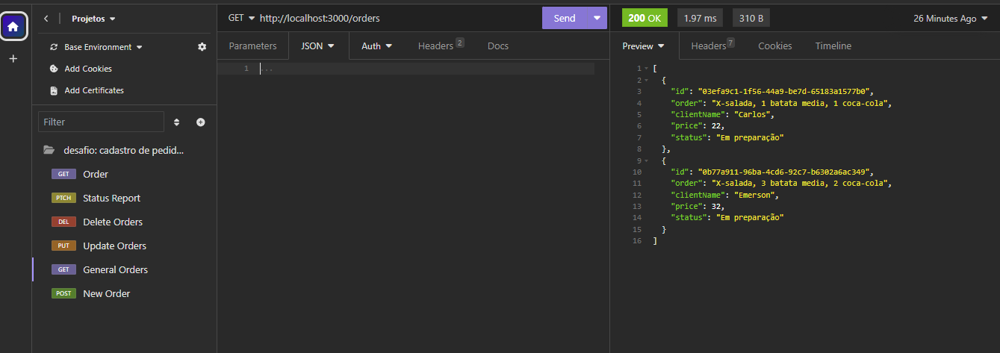
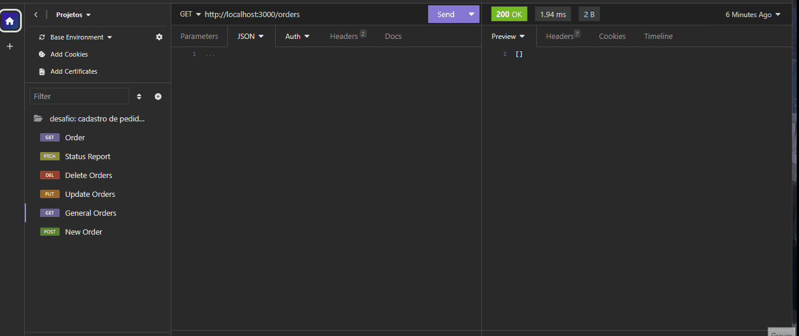
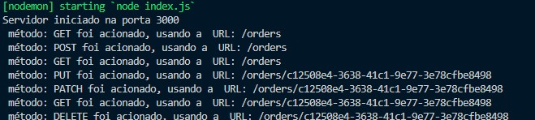

# Desafio Node - Requisições Hamburgueria

## Sumário

- [Visão geral](#visão-geral)
  - [O Desafio](#o-desafio)
  - [Screenshot](#screenshot)
- [Meu processo](#meu-processo)
  - [Tecnologias](#tecnologias-usadas)
  - [O que eu aprendi](#o-que-aprendi)
  - [Dificuldades](#dificuldades)
- [Contato](#contato)

## Visão Geral

### O Desafio

     Crie uma aplicação que fará o cadastro dos pedidos de uma hamburgueria, e utilizando Node e Express.

 - <strong>POST /order:</strong> A rota deve receber o pedido do cliente, o nome do cliente e o valor do pedido, essas informações devem ser passadas dentro do corpo(body) da requisição, e com essas informações você deve registrar o novo pedido dentro de um array no seguinte formato: { id: "ac3ebf68-e0ad-4c1d-9822-ff1b849589a8", order: "X- Salada, 2 batatas grandes, 1 coca-cola", clientName:"José", price: 44.50, status:"Em preparação" }. Não se esqueça que o ID deve ser gerado por você, dentro do código utilizando UUID V4, assim que o pedido é criado, você deve sempre colocar o status como "Em preparação".
  

- <strong>GET /order:</strong> Rota que lista todos os pedidos já feitos.
  

- <strong>PUT /order/:id:</strong> Essa rota deve alterar um pedido já feito. Pode alterar,um ou todos os dados do pedido.O id do pedido deve ser enviado nos parâmetros da rota.
  

 - <strong>DELETE /order/:id:</strong> Essa rota deve deletar um pedido já feito com o id enviado nos parâmetros da rota.
  

- <strong>GET /order/:id:</strong> Essa rota recebe o id nos parâmetros e deve retornar um pedido específico.
  

- <strong>PATCH /order/:id:</strong> Essa rota recebe o id nos parâmetros e assim que ela for chamada, deve alterar o status do pedido recebido pelo id para "Pronto".
  

### Middlewares

Crie um middleware que será utilizado em todas rotas que recebem o parâmetro ID, então ele deve verificar se o ID passado existe. Se não existir retorne um erro, caso contrário permita a requisição continuar normalmente;

Crie um middleware que é chamado em todas requisições que tenha um console.log que mostra o método da requisiçao(GET,POST,PUT,DELETE, etc) e também a url da requisição.

### Screenshot

## Meu Processo

### Tecnologias usadas:

- Javascript
- NodeJs
- ExpressJs
- Insomnia
- Git

### O que aprendi?

- Tive a oportunidade em aprender e entender melhor como funciona um aplicação com requisições para o servidor e retornando dados ao front-end, dos protocolos HTTP, do ambiente Node e o framework expressJs

### Dificuldades

- Os métodos HTTP, a lógica de como os dados de uma aplicação podem ser alterados por middlewares, além de todo o processo dos conceitos de NodeJs, como route params, query params e body params, e o proprio expressJs, foram um grande desafio. Com muita revisão e tentativas, pude compreender melhor sobre estas ferramentas!

## Contato

- Github - [mazziera.io](https://github.com/mazziera)
- Linkedin - [@raphael-mazzieri](https://www.linkedin.com/in/raphael-mazzieri/)
